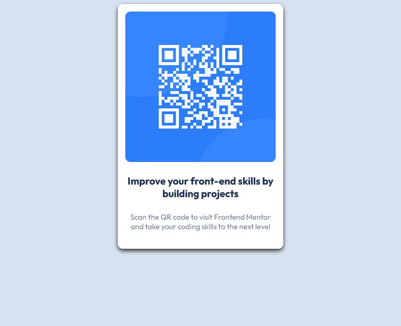

# qrcode-repo
This is a solution to the [QR code component challenge on Frontend Mentor](https://www.frontendmentor.io/challenges/qr-code-component-iux_sIO_H). Frontend Mentor challenges help you improve your coding skills by building realistic projects.

## Table of contents

- [Overview](#overview)
  - [Screenshot](#screenshot)
- [My process](#my-process)
  - [Built with](#built-with)
  - [What I learned](#what-i-learned)
  - [Continued development](#continued-development)
  - [Useful resources](#useful-resources)
- [Author](#author)

## Overview

### Screenshot


## My process

### Built with
- HTML
- CSS

### What I learned

```css
.card {
    box-shadow: 0 4px 8px 0 #2e2c2c;
    background-color: #fff;
    max-width: 300px;
    margin: auto;
    text-align: center;
    border-radius: 10px;
    padding: 15px;
}

.card img {
    border: 1px;
    border-radius: 10px;
    height: 100%;
    width: 100%;
}
```

### Continued development
I'd like to continue on focusing more on CSS
Especially with positioning as I struggled in this area the most during this project

### Useful resources
- [W3Schools](https://www.w3schools.com/howto/howto_css_profile_card.asp) - This helped me make the QR code/text to be formatted within a card.
- [W3Schools](https://www.w3schools.com/css/css3_images.asp) - Managed to set the image up correctly.

## Author
- GitHub - [OriginalMistake](https://github.com/OriginalMistake)
- Frontend Mentor - [@OriginalMistake](https://www.frontendmentor.io/profile/OriginalMistake)